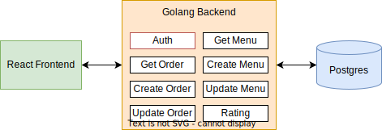

# Food Order System ( React Frontend )

 

## Installed Packages

- "react-redux": "^7.2.6"
- "ag-grid-react": "^27.0.0"
- "@material-ui": "v4"

 

Home page will show your menu list and today's open menu

 

Create Menu

 

Order meal

 

You can view / edit / delete your order

 

You can manage / edit your menu here

